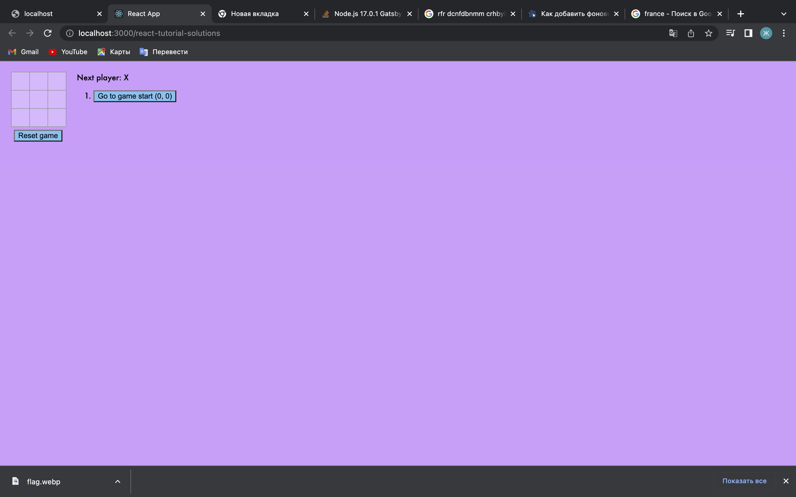
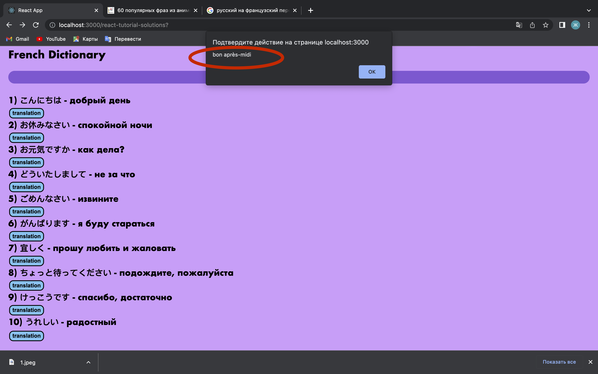
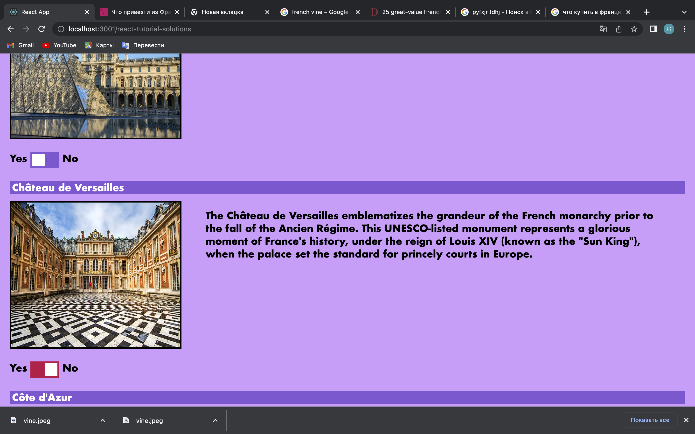

# Tic Tac Toe
Hello, here i will write how I changed this project

1) >I opened website with projects [link with examples](https://reactjs.org/community/examples.html) and chosed project Tutorial Solutions

After forked this project to my Github

2) >Next I picked random country from [random country](https://random.country)

3) >Started to change styles 
* Changed body,square and buttons color. 
  
* Made buttons and squares more attractive(added borders and margin). 

4) >Added first buttons, if you click on them you could find recipes of top 5 famous french foods. 
5) >Changed a little bit size of buttons and squares  and added japanese - french dictionary.
* if you click on button "translation" you will se alert window with translation

6) >Added new switch button (Yes or No) 
Function of this button is really easy, just click on it if you want to visit this place and the button (No) will change color

1) > And last component shopping list

just click on checkbox next to things that you have bought

8) > Added logo for extra points :)

