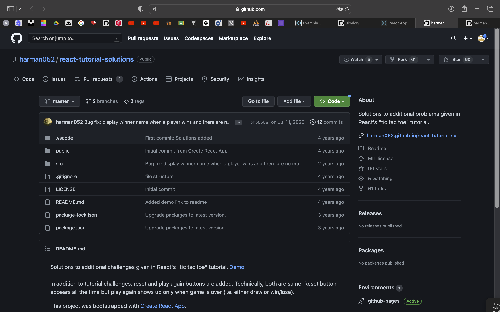

# Tic Tac Toe
Hello, here i will write how I changed this project

1) I opened website with projects https://reactjs.org/community/examples.html and chosed project Tutorial Solutions

After forked this project to my Github

2) Next I picked random country from https://random.country

3) Started to change styles 
* Changed body,square and buttons color 
* Made buttons and squares more attractive(added borders and margin) 
4) Added first buttons, if you click on them you could find recipes of top 5 famous french foods. 